# Quizz App.

A quiz app is a web application that allows users to take quizzes on various topics, test their knowledge

## About this Project:

An online practice test website is a web application that allows students to prepare for standardized tests or exams by taking practice tests, reviewing their performance, and tracking their progress. It typically features a comprehensive question bank, customizable practice tests, detailed performance analysis, and personalized feedback. Building an online practice test website using Laravel and MySQL provides a robust and scalable platform for delivering effective test preparation tools and enhancing student learning outcomes.
 
Connect with me at:

  &nbsp;&nbsp;

  📫 How to reach me: <a href='mailto:nben19732@gmail.com'>nben19732@gmail.com</a>

## Technology Used:
- Laravel Framework
- Vue3
- Mysql
- Tesseract OCR

## Free Features
### Student functions:
+ Register
+ Login
+ Change personal information, change avatar, change password, etc
+ Participate in practice or participate in exams organized by teachers
+ Search (exam questions, practice questions)
### Teacher's functions:
+ Register
+ Login
+ Change personal information, change avatar, change password, etc
+ Create exam questions (scan from photos, create manually)
+ Manage exam questions
+ Student management
+ Search (exam questions, students, teachers, etc.)

## Screen 

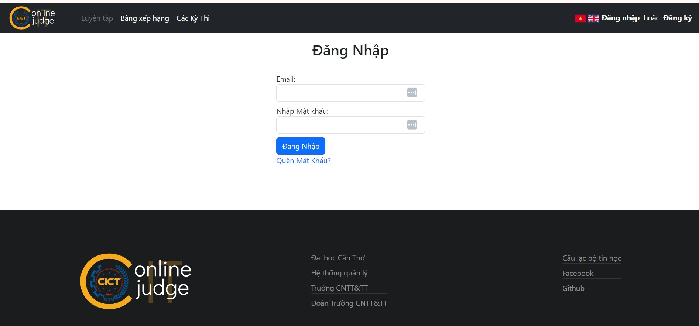

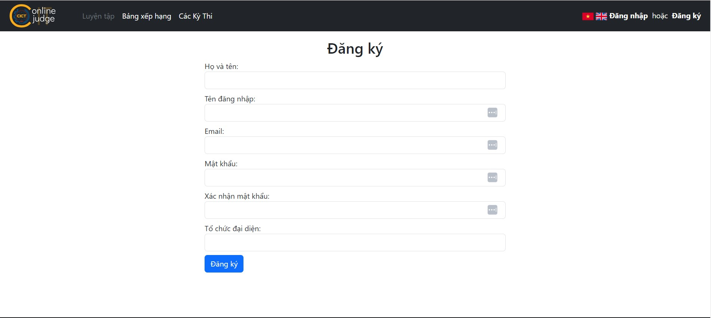

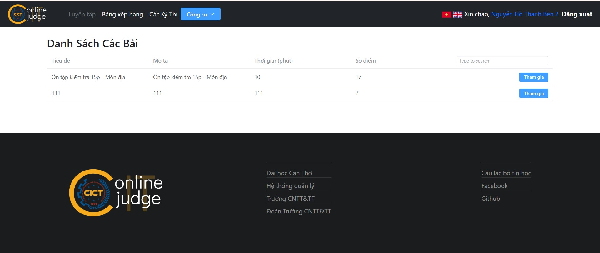

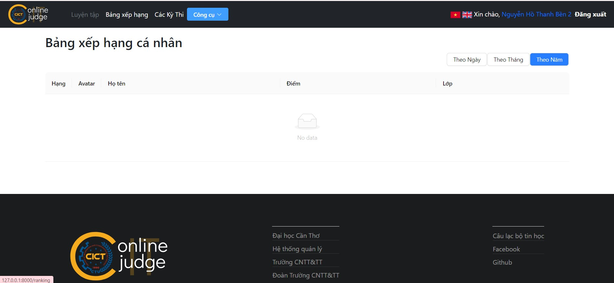

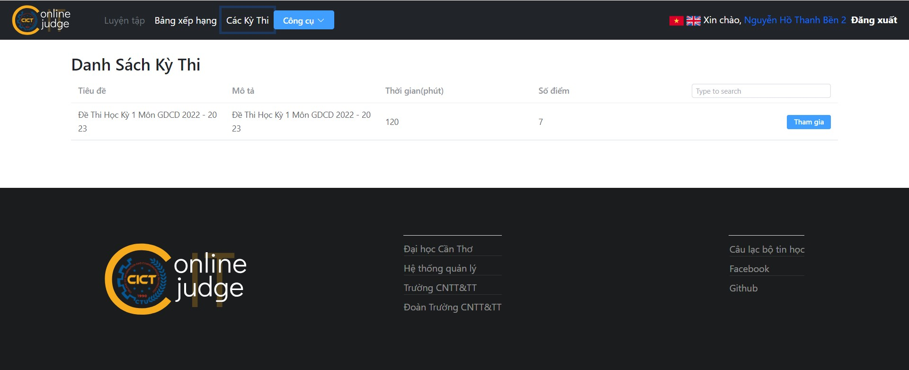

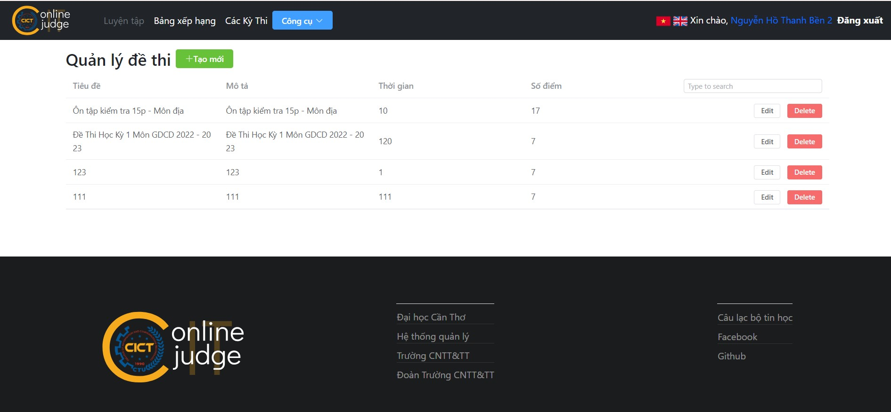

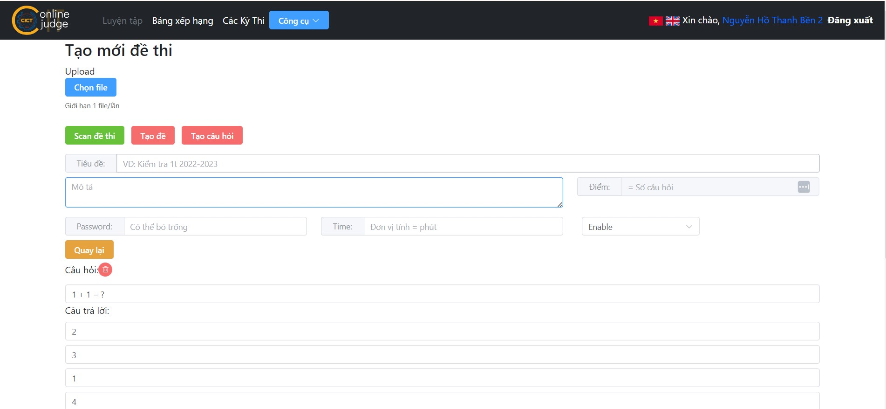

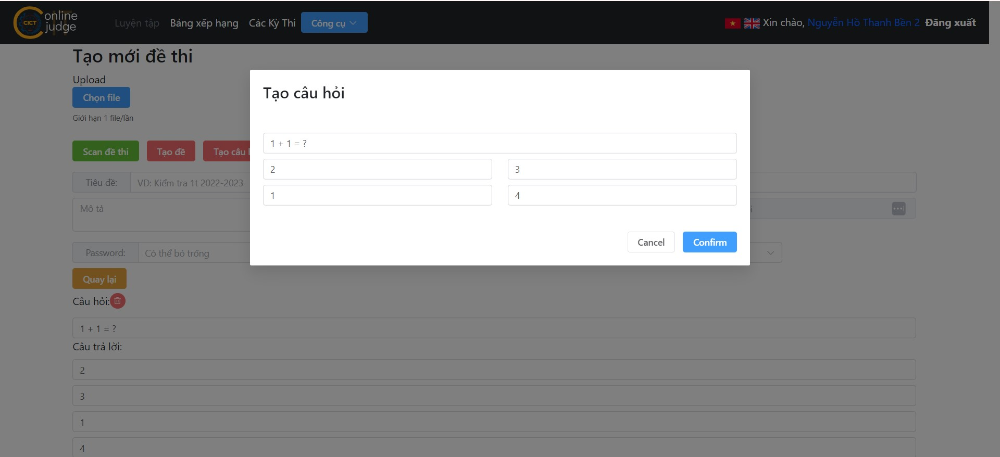

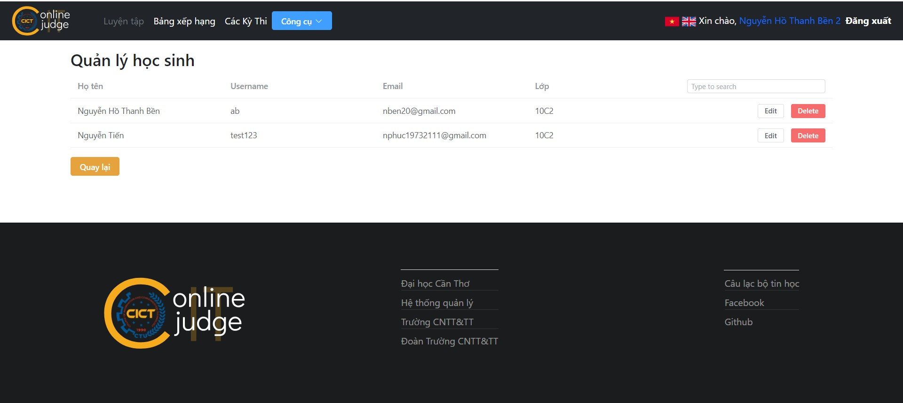

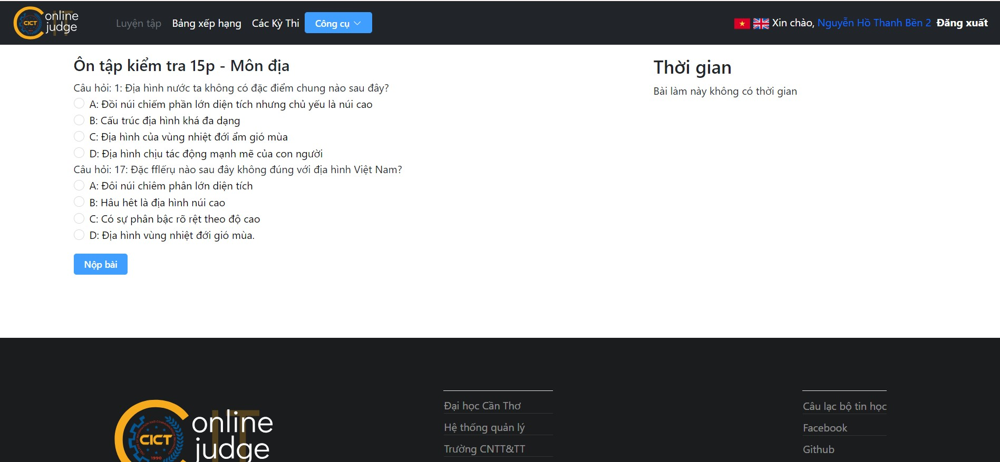

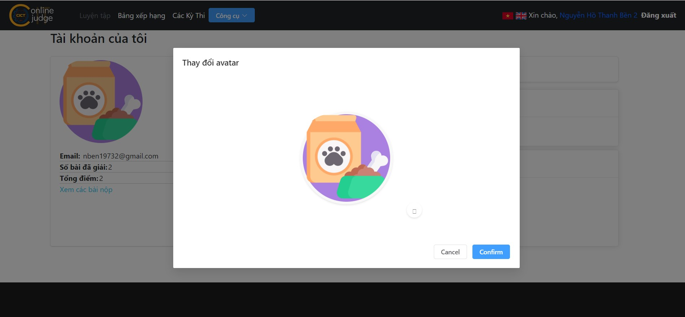
